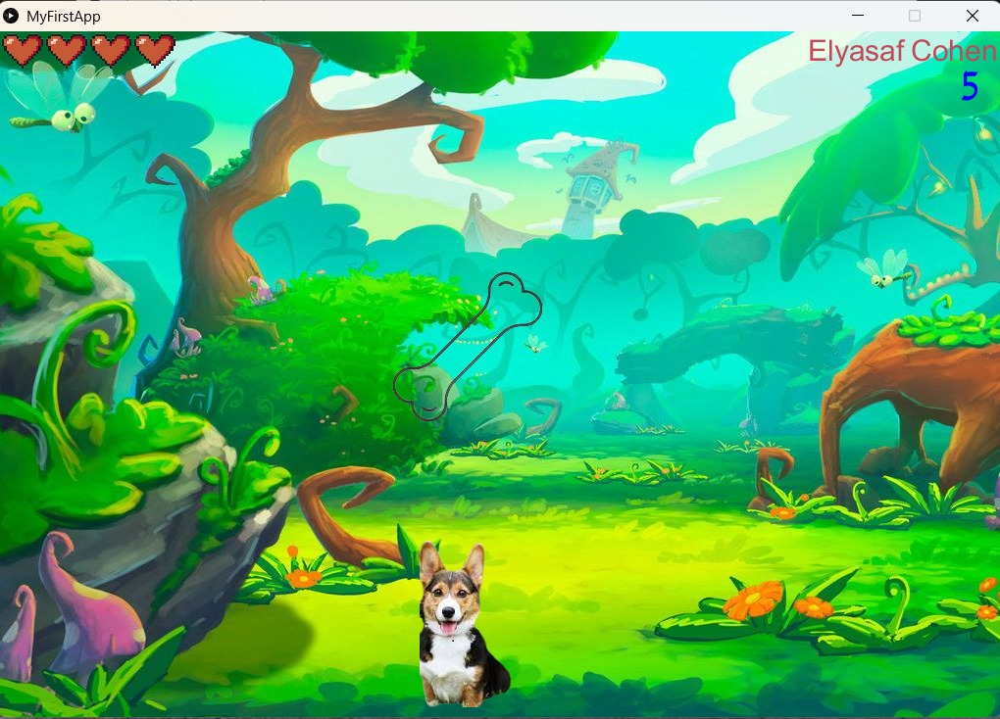
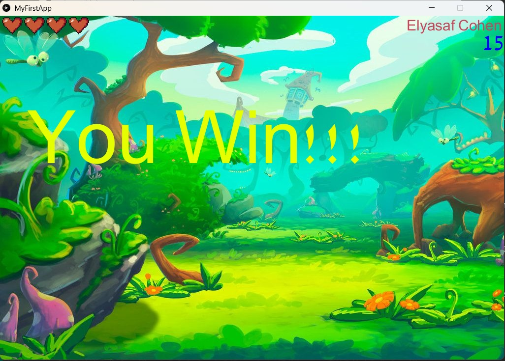
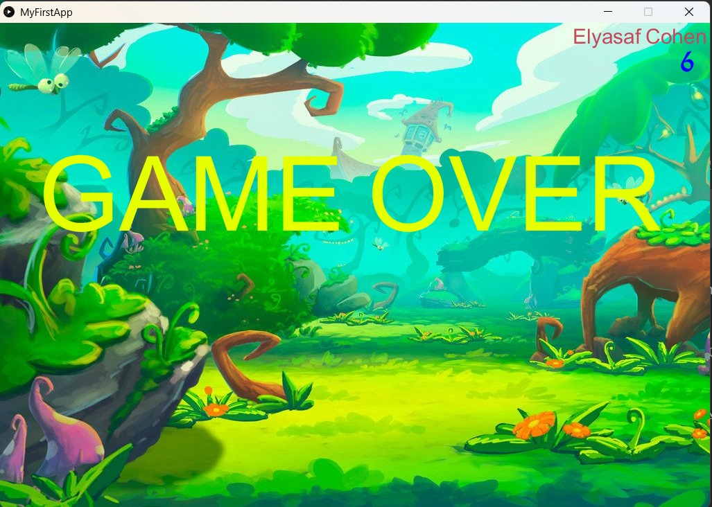

    

# 🐶 Doggy Bones Game 🦴

> **Mini Project | Creative Coding & Game Development**  
> A fun and interactive arcade-style game built with Processing

---

## 🏷️ Technologies & Tools

### 🎮 Game Development

### 🎨 Assets & Media

---

## ✨ Overview ✨

**Doggy Bones Game** is a cute and fun arcade-style game built with **Processing** 🐶🦴  
You play as a little dog who loves collecting bones — but be careful!  
If you lose all your hearts, it’s game over 💔

The goal is simple: **collect as many bones as possible and reach a high score** 🎯  
Easy to play, fun to master!

---

## 🎮 How to Play 🎮

- ⌨️ Move the dog using the keyboard  
- 🦴 Catch the falling bones  
- ❤️ Avoid losing all your hearts  
- 🏆 Try to beat your high score  

---

## 📁 Project Files 📁

- `MyFirstApp.pde` – main game logic  
- `nitz13D.pde` – helper classes and extra logic  
- `data/` – images, sounds, and fonts  

---

## 🖼️ Screenshots 🖼️

### 🕹️ In-Game Gameplay  

### 🏆 Win Screen  

### 🎬 Game Over Screen  

---

## 🎥 Gameplay Demo 🎥

---

## Create with good vibes by: 🎉

  

                                            

                    
  <a href="https://github.com/ElyasafCohen100">
      Elyasaf Cohen 🤟😎
    
  </a>

---

## 💥 Final Notes 💥

This project demonstrates:
- Creative game design  
- Basic game mechanics and scoring systems  
- Use of graphics, sound, and user input  
- Fun-first development with clean structure  

---

> ✨ If you like this project – please leave a star! ✨ 
